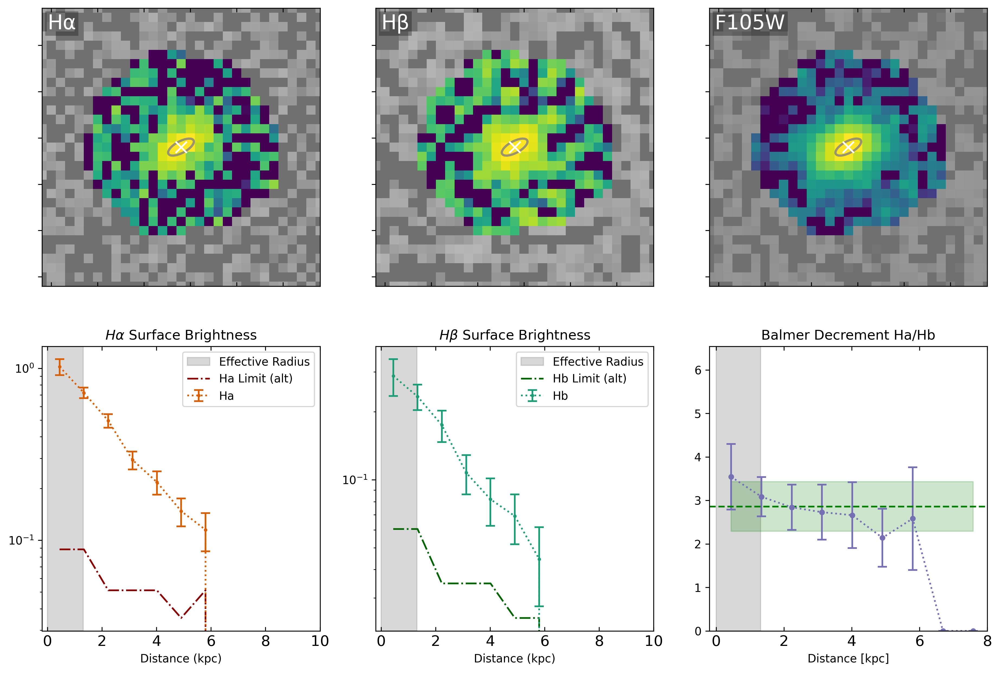

# Measuring spatially resolved Balmer Decrement of Galaxies in CLEAR Survey

This directory contains the code and documentation for measuring the spatially resolved Balmer Decrement of galaxies in the [CLEAR](https://archive.stsci.edu/hlsp/clear) (CANDELS Lyman-alpha Emission at Reionization) survey for an ongoing draft paper. The full analaysis pipeline is given in this repository. The main workflow is controlled by [Snakemake](https://snakemake.readthedocs.io/en/stable/) as the `Snakefile` and 'config.yaml' in this repo.

>

